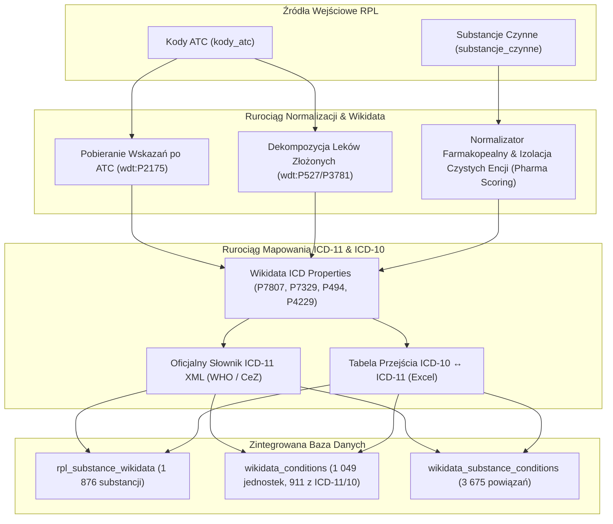

# Rurociągi Danych i Źródła Informacji (Data Pipelines)

System integruje wiele zróżnicowanych źródeł danych: urzędowe rejestry państwowe (RPL, NFZ, GIF/RDG), otwarte ontologie wiedzy (Wikidata) oraz pliki obiektowe Charakterystyk Produktów Leczniczych (ChPL Markdown) przechowywane w chmurze S3.

---

## 1. Wykaz Źródeł Danych

```
┌────────────────────────────────────────────────────────────────────────────────────────┐
│                                   ŹRÓDŁA DANYCH                                        │
├──────────────────────┬──────────────────────┬───────────────────┬──────────────────────┤
│ Rejestr RPL (URPL)   │ Wykaz Refundacyjny   │ Decyzje GIF (RDG) │ Wikidata (Ontologia) │
│ Rejestr Produktów    │ Ministerstwo Zdrowia │ Główny Inspektor  │ Otwarte powiązania   │
│ Leczniczych (XML)    │ i NFZ (Excel / CSV)  │ Farmaceutyczny    │ interakcji lekowych  │
│ 20 223 leki ludzkie  │ 6 247 pozycji A1-E   │ 695 decyzji RDG   │ 10 570 par interakcji│
└──────────┬───────────┴──────────┬───────────┴─────────┬─────────┴──────────┬───────────┘
           │                      │                     │                    │
           ▼                      ▼                     ▼                    ▼
┌────────────────────────────────────────────────────────────────────────────────────────┐
│                        ZJEDNOLICONA BAZA DANYCH SQLITE (data/rpl.db)                   │
└────────────────────────────────────────────────────────────────────────────────────────┘
```

---

## 2. Rurociąg Główny: Rejestr RPL i Teksty ChPL (`fast_pipeline.py`)

### 2.1 Parsowanie Urzędowego XML (`overall.xml`)
- Główny plik rejestru zawiera wszystkie dopuszczone do obrotu preparaty lecznicze.
- **Filtracja preparatów ludzkich**: System rygorystycznie odrzuca preparaty weterynaryjne (`rodzaj_preparatu == "ludzki"`), gwarantując brak niepełnych wpisów i placeholderów.
- Ekstrakcja metadanych:
  - Nazwa handlowa, postać farmaceutyczna, moc, podmiot odpowiedzialny, numer i ważność pozwolenia.
  - Substancje czynne (nazwa, ilość, jednostka).
  - Kody ATC (hierarchia anatomiczno-terapeutyczno-chemiczna).
  - Opakowania (wielkość, kategoria dostępności: OTC, Rp, Rpw, Rpz, kody GTIN / EAN).

### 2.2 Pobieranie i Weryfikacja ChPL z S3
- Teksty Charakterystyk Produktów Leczniczych w formacie Markdown są pobierane z zasobnika S3 (`s3://plek/`).
- Tekst jest weryfikowany pod kątem spójności z bazą relacyjną (`produkt_id`).
- Tylko zarejestrowane leki ludzkie (dokładnie **11 084 dokumenty**) trafiają do indeksów wektorowych i pełnotekstowych.

### 2.3 Generowanie Embeddingów PolDense-400M
- Tekst Markdown ChPL jest dzielony na okna 4096 tokenów z krokiem 256 tokenów.
- Akcelerator GPU (CUDA) generuje wektory $D = 1024$.
- Po wykonaniu *Mean Poolingu* i normalizacji $L_2$, wektory są zapisywane do tabeli `vec_dokumenty` w SQLite.

### 2.4 Indeksowanie Pełnotekstowe z Morfeuszem
- Treści ChPL, nazwy leków, substancje czynne i opisy ATC są analizowane morfologicznie przez bibliotekę **Morfeusz 2**.
- Formy odmienione zostają zredukowane do form hasłowych (lematów) i zaindeksowane w tabeli `fts_dokumenty` SQLite FTS5.

---

## 3. Rurociąg Refundacyjny: Ministerstwo Zdrowia i NFZ (`import_refundacja.py`)

Wykaz leków refundowanych jest publikowany co 2-3 miesiące w postaci obwieszczenia Ministra Zdrowia.

### 3.1 Przetwarzanie Arkuszy
Skrypt `python/import_refundacja.py` wczytuje i parsuje pozycje ze wszystkich oficjalnych załączników:
- **A1, A2, A3**: Leki dostępne w aptece na receptę (dostępne w refundacji aptecznej).
- **B**: Leki stosowane w chemioterapii.
- **C**: Leki w programach lekowych.
- **D1, D2**: Środki spożywcze specjalnego przeznaczenia żywieniowego i wyroby medyczne.
- **E**: Leki sprowadzane w ramach importu docelowego.

### 3.2 Relacja z Bazą RPL
- Łączenie danych odbywa się po znormalizowanym kodzie **GTIN**:
  $$\text{ltrim}(opakowania.kod\_gtin, \text{'0'}) = \text{refundacja}.kod\_gtin\_norm$$
- Ekstrakcja danych finansowych: cena detaliczna, urzędowy limit finansowania, poziom odpłatności (np. ryczałt, 30%, 50%, bezpłatny), wysokość dopłaty pacjenta oraz zakres wskazań objętych refundacją.
- Flagi bezpłatnych leków: **Senior 65+**, **Dzieci <18**, **Kobiety w ciąży**.

---

## 4. Rurociąg Decyzji Nadzorczych GIF / RDG (`import_decyzje_gif.py`)

Skrypt `python/import_decyzje_gif.py` pobiera oficjalne decyzje Głównego Inspektora Farmaceutycznego bezpośrednio z Rejestru Decyzji Głównych (RDG):
- **Endpoint**: `https://rdg.ezdrowie.gov.pl/Decision/DownloadPublicXml`
- **Kategorie decyzji**:
  - `Wycofanie z obrotu` (Medicine Recall)
  - `Wstrzymanie w obrocie` (Temporary Suspension)
  - `Zakaz wprowadzania` (Market Entry Prohibition)
  - `Ponowne dopuszczenie do obrotu`
- **Pola danych**: numer decyzji, data wydania, nazwa handlowa, moc, postać, numery serii, data ważności oraz bezpośredni link do pobrania urzędowego dokumentu PDF (`https://rdg.ezdrowie.gov.pl/pobierz-decyzje/{UUID}`).

---

### 5. Rurociąg Interakcji Lekowych: Wikidata SPARQL (`import_wikidata_interactions.py`)

Interakcje farmakologiczne są pobierane ze społecznościowej ontologii wiedzy **Wikidata** (Wikiprojekt Lekoznawstwo).

### 5.1 Zapytanie SPARQL
```sparql
SELECT ?substance ?substanceLabel ?substanceAtc ?interactsWith ?interactsWithLabel ?interactsWithAtc WHERE {
  ?substance wdt:P769 ?interactsWith .
  OPTIONAL { ?substance wdt:P267 ?substanceAtc . }
  OPTIONAL { ?interactsWith wdt:P267 ?interactsWithAtc . }
  SERVICE wikibase:label { bd:serviceParam wikibase:language "pl,en". }
}
```

### 5.2 Algorytm Mapowania Dwuścieżkowego (Dual-Track Interaction Discovery)
W celu zapewnienia pełnego pokrycia interakcji zarówno dla leków jednoskładnikowych, jak i złożonych produktów wielolekowych:
1. **Ścieżka A (Kody ATC)**: Odczytanie kodu ATC danego produktu leczniczego w RPL (np. `B01AC06` dla kwasu acetylosalicylowego) i dopasowanie do encji Wikidata (`wdt:P267`) $\to$ `Q18216`.
2. **Ścieżka B (Dekompozycja składników czynnych `substancje_czynne`)**: Dla leków złożonych o zbiorczych kodach ATC (np. `N02BE51`, `J05AR01`), zapytanie odnajduje encje Wikidata dla poszczególnych substancji (`rpl_substance_wikidata`) i łączy ich interakcje.
3. **Pobranie interakcji (`wdt:P769`)**: Wyszukanie wszystkich substancji wchodzących w interakcję z dowolnym ze składników preparatu.
4. **Wielotorowe wyszukiwanie leków przykładowych**: Dla każdej wchodzącej w interakcję substancji system odnajduje zarejestrowane w Polsce leki referencyjne na podstawie kodów ATC oraz nazw znormalizowanych substancji czynnych (`sc.nazwa_substancji`).

---

## 6. Rurociąg Leków Procedury Centralnej (CEN / EMA / Komisja Europejska) (`import_cen_pipeline.py`)

Leki rejestrowane w procedurze centralnej (**CEN**) nie posiadają krajowych linków ChPL w rejestrze URPL, ponieważ ich autoryzacja i dokumentacja są publikowane bezpośrednio przez **Komisję Europejską (DG SANTE / Union Register)** oraz **EMA**.

### 6.1 Algorytm Dopasowania (RPL $\to$ Unijny Rejestr)
1. **Pobranie Otwartego Zbioru Komisji Europejskiej**:
   - Źródło: `https://ec.europa.eu/health/documents/community-register/ods/ods_products.json`
   - Indeksowanie po numerze unijnym `EUNumber` (`EU/1/YY/NNN`) oraz po znormalizowanych nazwach handlowych.
2. **Mapowanie z `opakowania.numer_eu` w RPL**:
   - Z kodów jednostek opakowań (np. `EU/1/97/046/004`) wyodrębniany jest prefiks autoryzacji bazowej `EU/1/97/046`.
   - Skuteczność dopasowania: **100% (3 825 / 3 825 leków CEN)**.

### 6.2 Przetwarzanie i Ekstrakcja ChPL
1. **Wielowątkowe Pobieranie Aneksów PDF**:
   - Pobieranie oficjalnych polskich aneksów decyzji (`anx_XXXXXX_pl.pdf`).
   - Caching po unikalnym adresie URL decyzji.
2. **Konwersja PyMuPDF (fitz) $\to$ Markdown**:
   - Automatyczne wycinanie **Aneksu I (*Charakterystyka Produktu Leczniczego*)**.
   - Normalizacja nagłówków (`# CHARAKTERYSTYKA PRODUKTU LECZNICZEGO`, `## 1. NAZWA...`, `### 4.1 Wskazania do stosowania`).
3. **Kopia Zapasowa w S3 (`s3://plek/`)**:
   - Zapis surowych PDF: `s3://plek/pdf_eu/{produkt_id}.pdf`
   - Zapis sformatowanego Markdown: `s3://plek/md_eu/{produkt_id}.md`
4. **Embeddingi Wektorowe & FTS5**:
   - Generowanie wektorów 1024-d za pomocą `PolDense-400M` z oknem 4096 tokenów.
   - Indeksowanie do tabeli `vec_dokumenty` oraz `fts_dokumenty` z tokenizacją Morfeusza.
   - Zapis embeddingów binarnych do `s3://plek/embeddings/{produkt_id}.bin`.

---

## 7. Rurociąg Wskazań Medycznych & Mapowania ICD-11 / ICD-10 (`import_icd_mapping.py` + `import_rpl_substances_wikidata.py`)

Umożliwia automatyczne przypisywanie jednostek chorobowych, kodów **ICD-11 MMS**, **ICD-11 Foundation ID** oraz **ICD-10** wraz z oficjalnymi polskimi nazwami do poszczególnych leków zarejestrowanych w RPL.



### 7.1 Wykorzystane Źródła Danych
1. **Oficjalny Polski Słownik ICD-11 (WHO / CeZ)**:
   - Plik: `icd11_2026-01_pl_in.xml` (37 212 encji).
   - Pełna hierarchia drzewiasta, kody MMS, identyfikatory Foundation ID oraz oficjalne tłumaczenia jednostek chorobowych na język polski.
2. **Oficjalna Tabela Przejścia ICD-10 $\leftrightarrow$ ICD-11**:
   - Plik: `10To11MapdowieluKategorii.xlsx` (15 556 reguł).
   - Dwukierunkowa translacja pomiędzy kodami ICD-10 a kodami MMS i identyfikatorami Foundation ID.
3. **Wikidata SPARQL Knowledge Graph**:
   - Wskazania lecznicze: `wdt:P2175` (*medical condition treated*).
   - Właściwości ICD: `wdt:P7807` (*ICD-11 Foundation ID*), `wdt:P7329` (*ICD-11 MMS code*), `wdt:P494` / `wdt:P4229` (*ICD-10 / ICD-10-CM*).

---

### 7.2 Algorytm Izolacji Czystych Substancji i Uszczelnienia Dopasowania

W procesie mapowania substancji farmakopealnych z RPL (`substancje_czynne`) do bazy Wikidata wdrożono rygorystyczny algorytm zapobiegający trzem typowym błędom ontologicznym:

#### 1. Wykluczenie Przechwytywania przez Leki Złożone (*Combination Drug Hijacking*)
* **Problem**: Encje leków złożonych (np. `amlodipine / perindopril`, `lamivudine / raltegravir`, `budesonide / salmeterol`) mają etykiety rozpoczynające się od nazwy pojedynczej substancji. Naiwne dopasowywanie prefiksowe powodowało, że lek jednoskładnikowy (np. czysta amlodypina) był błędnie mapowany do encji leku dwuskładnikowego.
* **Rozwiązanie**:
  * Zapytania SPARQL bezwzględnie wykluczają leki złożone: `FILTER NOT EXISTS { ?substance wdt:P31 wd:Q1779868 }`.
  * Filtrowanie w kodzie Pythona odrzuca etykiety zawierające separatory połączeń (`/`, `+`, `&`, ` and `, ` with `, ` w połączeniu`).

#### 2. Weryfikacja Farmakologiczna (*Pharma Property Scoring*)
* **Problem**: Rdzenie substancji mogą przypadkowo odpowiadać zwykłym słowom w innych językach lub toponimom (np. *kopalnia* / *mina* dla `99m Tc Nadtechncjan sodu`).
* **Rozwiązanie**: Każda kandydacka encja z Wikidata musi posiadać co najmniej jeden zweryfikowany atrybut chemiczno-farmakologiczny:
  $$\text{Score} = 3 \cdot [\text{P267 (ATC)}] + 3 \cdot [\text{P2175 (Wskazanie)}] + 2 \cdot [\text{P662 (PubChem)}] + 2 \cdot [\text{P769 (Interakcja)}] + 1 \cdot [\text{P231 (CAS)}]$$
  Encje o $\text{Score} = 0$ są bezwzględnie odrzucane.

#### 3. Normalizator Farmakopealny & Odmiany Soli (1-to-Many Mapping)
* **Problem**: W rejestrze RPL substancje występują w postaci łacińskiej z oznaczeniem soli/hydratu (np. `Amlodipini besilas`, `Amlodipini maleas`, `Atorvastatinum calcicum trihydricum`).
* **Rozwiązanie**:
  * Wycinanie ponad 40 form soli i hydratów za pomocą wyrażeń regularnych (`hydrochloridum`, `besilas`, `maleas`, `mesilas`, `tartras`, `monohydricum`, `calcicum` itd.).
  * Generowanie wariantów INN (angielskie *-e*, *-ine*), polskich fonetycznych ($v \to w$, interwokaliczne $s \to z$, końcówki *-a*, *-ina*, *-yna*) oraz rdzeni łacińskich.
  * Relacja **1-do-wielu**: Każdy wygenerowany rdzeń mapuje jednocześnie na wszystkie zarejestrowane w RPL warianty soli danej substancji, eliminując nadpisywanie w słownikach.

---

### 7.3 Wielopoziomowe Rozpoznawanie Kodów ICD-11 & ICD-10 (Multi-Layer Resolution)

Po pobraniu identyfikatorów rozpoznań z Wikidata (`wdt:P2175`), skrypt `import_icd_mapping.py` przeprowadza kaskadowe dopasowanie kodów:

```
[Wskazanie z Wikidata (QID)]
          │
          ├──> 1. Foundation ID (P7807) ──> Oficjalny XML ICD-11 ──> Oficjalna nazwa PL + Kod MMS
          │
          ├──> 2. Kod MMS (P7329)       ──> Oficjalny XML ICD-11 ──> Oficjalna nazwa PL + Foundation ID
          │
          ├──> 3. Kod ICD-10 (P494)     ──> Tabela Przejścia 10→11 ──> Kod MMS + Foundation ID + Nazwa PL
          │
          └──> 4. Mapowanie Zwrotne 11→10 ─────────────────────────> Uzupełnienie brakujących kodów ICD-10
```

---

### 7.4 Instrukcja Reprodukcji (End-to-End Execution)

Wszystkie niezbędne pliki źródłowe znajdują się w katalogu `data/icd_raw/`:
- `data/icd_raw/icd11_2026-01_pl_in.xml` (Oficjalny polski słownik ICD-11 WHO / CeZ)
- `data/icd_raw/10To11MapdowieluKategorii.xlsx` (Tabela przejścia ICD-10 ↔ ICD-11)

#### Uruchomienie Pełnego Rurociągu (1 polecenie):
```bash
./scripts/run_icd_pipeline.sh
# lub bezpośrednio przez interpreter Pythona:
python/.venv/bin/python python/run_full_icd_pipeline.py
```

#### Uruchomienie Krok po Kroku:
```bash
# Krok 1: Pobranie wskazań z Wikidata po kodach ATC i składowych leków złożonych
python/.venv/bin/python python/import_wikidata_uses.py

# Krok 2: Zaawansowane mapowanie substancji czynnych (substancje_czynne -> Wikidata z Pharma Scoring)
python/.venv/bin/python python/import_rpl_substances_wikidata.py

# Krok 3: Rozwiązanie ICD-11 MMS, Foundation ID, kodów ICD-10 i oficjalnych polskich nazw medycznych
python/.venv/bin/python python/import_icd_mapping.py
```

