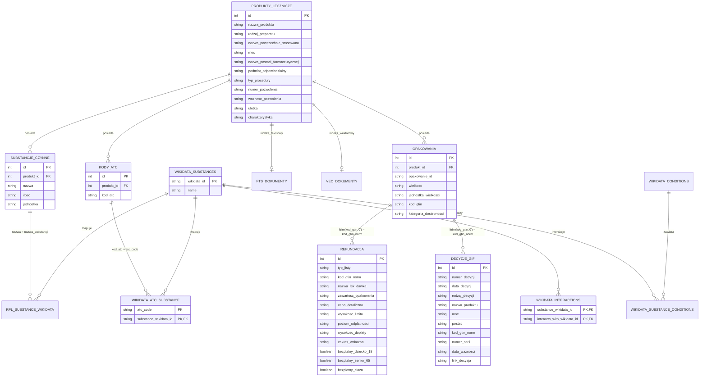

# Schemat Bazy Danych (SQLite Data Schema)

Baza danych projektu znajduje się w pliku `data/rpl.db`. Jest to w pełni zintegrowana baza **SQLite 3.45+** zawierająca tabele relacyjne, wirtualne tabele pełnotekstowe **FTS5** oraz wirtualne tabele indeksów wektorowych **sqlite-vec (`vec0`)**.

---

## 1. Diagram Relacji Bazy Danych (ERD)



---

## 2. Specyfikacja Tabel

### 2.1 Tabele Relacyjne Rdzenia RPL

#### `produkty_lecznicze`
Główna tabela leków zarejestrowanych w Polsce (wyłącznie preparaty ludzkie).
- `id` (INTEGER PRIMARY KEY): Identyfikator produktu leczniczego w urzędowym rejestrze.
- `nazwa_produktu` (TEXT NOT NULL): Nazwa handlowa preparatu.
- `rodzaj_preparatu` (TEXT): Zawsze `"ludzki"`.
- `nazwa_powszechnie_stosowana` (TEXT): Nazwa międzynarodowa (INN).
- `moc` (TEXT): Dawka / moc substancji.
- `nazwa_postaci_farmaceutycznej` (TEXT): Np. *tabletki powlekane*, *krople do oczu*.
- `podmiot_odpowiedzialny` (TEXT): Producent / dystrybutor.
- `typ_procedury` (TEXT): Procedura rejestracji (*NAR*, *MRP*, *DCP*, *CEN*).
- `numer_pozwolenia` (TEXT): Numer pozwolenia na dopuszczenie do obrotu.
- `waznosc_pozwolenia` (TEXT): *Bezterminowe* lub data ważności.
- `ulotka` (TEXT): Oficjalny URL do ulotki dla pacjenta (PIL).
- `charakterystyka` (TEXT): Oficjalny URL do ChPL (SmPC).

#### `substancje_czynne`
- `id` (INTEGER PRIMARY KEY AUTOINCREMENT)
- `produkt_id` (INTEGER REFERENCES produkty_lecznicze(id))
- `nazwa` (TEXT NOT NULL): Nazwa chemiczna / farmakopealna substancji.
- `ilosc` (TEXT): Ilość substancji w jednostce dawkowania.
- `jednostka` (TEXT): Jednostka miary (*mg*, *g*, *ml*, *j.m.*).

#### `kody_atc`
- `id` (INTEGER PRIMARY KEY AUTOINCREMENT)
- `produkt_id` (INTEGER REFERENCES produkty_lecznicze(id))
- `kod_atc` (TEXT NOT NULL): 7-znakowy kod anatomiczno-terapeutyczny WHO (np. `N02BA01`).

#### `opakowania`
- `id` (INTEGER PRIMARY KEY AUTOINCREMENT)
- `produkt_id` (INTEGER REFERENCES produkty_lecznicze(id))
- `opakowanie_id` (TEXT)
- `wielkosc` (TEXT), `jednostka_wielkosci` (TEXT)
- `kod_gtin` (TEXT): Kod kreskowy EAN/GTIN.
- `kategoria_dostepnosci` (TEXT): *OTC*, *Rp*, *Rpz*, *Rpw*, *Lz*.

---

### 2.2 Tabele Wyszukiwania Pełnotekstowego i Wektorowego

#### `fts_dokumenty` (Wirtualna Tabela SQLite FTS5)
```sql
CREATE VIRTUAL TABLE fts_dokumenty USING fts5(
    produkt_id UNINDEXED,
    nazwa_produktu,
    substancje_czynne,
    klasyfikacja_atc,
    chpl_content,
    tokenize = 'unicode61'
);
```
Zawiera zlematyzowane słownikowo (Morfeusz 2) teksty ułatwiające precyzyjne odnajdywanie fraz w dowolnej formie deklinacyjnej.

#### `vec_dokumenty` (Wirtualna Tabela sqlite-vec)
```sql
CREATE VIRTUAL TABLE vec_dokumenty USING vec0(
    produkt_id INTEGER PRIMARY KEY,
    embedding float[1024] distance_metric=cosine
);
```
Zawiera 1024-wymiarowe wektory gęste wygenerowane przez `PolDense-400M` z pełnych tekstów ChPL.

---

### 2.3 Tabele Wzbogacające (Refundacja, GIF, Wikidata)

#### `refundacja`
Wykaz refundacyjny Ministerstwa Zdrowia i NFZ.
- `kod_gtin_norm` (TEXT): Znormalizowany GTIN (`ltrim(kod_gtin, '0')`).
- `typ_listy` (TEXT): Oznaczenie załącznika (*A1*, *A2*, *B*, *C*, *D1*, *E*).
- `cena_detaliczna` (TEXT), `wysokosc_limitu` (TEXT), `poziom_odplatnosci` (TEXT), `wysokosc_doplaty` (TEXT).
- `zakres_wskazan` (TEXT): Wskazania medyczne objęte refundacją.
- `bezplatny_dziecko_18` (INTEGER), `bezplatny_senior_65` (INTEGER), `bezplatny_ciaza` (INTEGER): Flagi uprawnień bezpłatnych.

#### `decyzje_gif`
Oficjalny rejestr decyzji Głównego Inspektora Farmaceutycznego.
- `numer_decyzji` (TEXT): Np. `13/WC/2019`.
- `data_decyzji` (TEXT): Data wydania decyzji (YYYY-MM-DD).
- `rodzaj_decyzji` (TEXT): *Wycofanie z obrotu*, *Wstrzymanie w obrocie*, *Zakaz wprowadzania*.
- `nazwa_produktu` (TEXT), `moc` (TEXT), `postac` (TEXT), `kod_gtin_norm` (TEXT).
- `numer_serii` (TEXT): Konkretne numery partii objęte decyzją.
- `link_decyzja` (TEXT): Bezpośredni URL do pliku PDF z uzasadnieniem GIF.

#### `wikidata_substances`, `wikidata_atc_substance`, `wikidata_interactions`
Ontologia substancji i interakcji lekowych z Wikidata.
- `wikidata_substances (wikidata_id TEXT PRIMARY KEY, name TEXT NOT NULL)`
- `wikidata_atc_substance (atc_code TEXT NOT NULL, substance_wikidata_id TEXT NOT NULL, PRIMARY KEY(atc_code, substance_wikidata_id))`
- `wikidata_interactions (substance_wikidata_id TEXT NOT NULL, interacts_with_wikidata_id TEXT NOT NULL, PRIMARY KEY(substance_wikidata_id, interacts_with_wikidata_id))`

#### `rpl_substance_wikidata`
Bezpośrednie mapowanie nazw substancji czynnych z rejestru RPL (Ph. Eur. / FP) do encji Wikidata.
- `nazwa_substancji` (TEXT PRIMARY KEY): Nazwa substancji w RPL (np. *Paracetamolum*, *Coffeinum*, *Ibuprofenum*).
- `wikidata_id` (TEXT NOT NULL REFERENCES wikidata_substances(wikidata_id)): Identyfikator QID.
- `substance_name` (TEXT): Kanoniczna polska/angielska nazwa substancji.

#### `wikidata_conditions` & `wikidata_substance_conditions`
Mapowanie jednostek chorobowych, wskazań medycznych oraz klasyfikacji **ICD-11** i **ICD-10**.
- `wikidata_conditions`:
  - `condition_wikidata_id` (TEXT PRIMARY KEY): Np. `Q12206` (*cukrzyca*), `Q81938` (*ból*).
  - `name` (TEXT NOT NULL): Etykieta jednostki w Wikidata.
  - `official_pl_name` (TEXT): Oficjalna nazwa medyczna ze słownika WHO / CeZ (np. *Cukrzyca typu 2*, *Pierwotna hipercholesterolemia*).
  - `icd11_mms` (TEXT): Kod linearyzacji ICD-11 MMS (np. `5A11`, `MG3Z`, `BA6Z`).
  - `icd11_foundation_id` (TEXT): Identyfikator Foundation URI WHO (np. `119724091`, `661232217`).
  - `icd11_url` (TEXT): Bezpośredni URL do przeglądarki WHO (`https://icd.who.int/browse/2026-01/mms/en#{fid}`).
  - `icd10_codes` (TEXT): Zgodne kody ICD-10 (np. `E11`, `R52.9`, `I20-I25`).
- `wikidata_substance_conditions`:
  - `substance_wikidata_id` (TEXT), `condition_wikidata_id` (TEXT), `use_type` (TEXT DEFAULT `'condition_treated'`).
  - `PRIMARY KEY (substance_wikidata_id, condition_wikidata_id)`.

