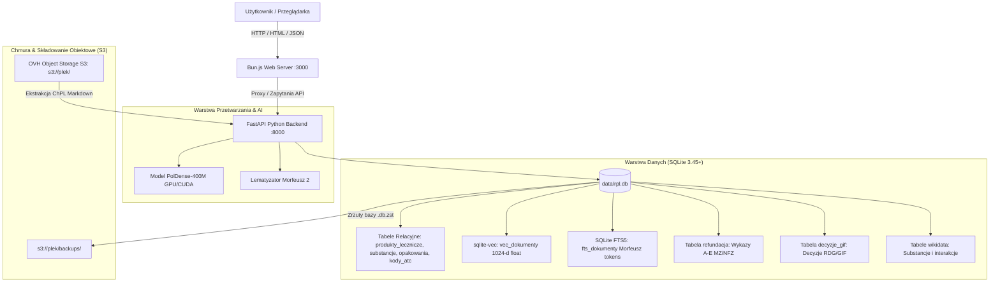

# Rejestr Produktów Leczniczych (RPL) — Hybrydowa Wyszukiwarka Semantyczna

Nowoczesna, wysokowydajna platforma wyszukiwania semantycznego i analityki dla **Rejestru Produktów Leczniczych (RPL)** w Polsce. System łączy pełnotekstowe wyszukiwanie leksykalne z fleksyjną lematyzacją języka polskiego (**FTS5 + Morfeusz**) oraz wyszukiwanie wektorowe oparte na głębokich modelach językowych (**sqlite-vec + PolDense-400M**), zintegrowane za pomocą algorytmu **Reciprocal Rank Fusion (RRF)**.

System jest wzbogacony o urzędowe wykazy **refundacji leków (MZ/NFZ)**, rejestr **decyzji nadzorczych Głównego Inspektoratu Farmaceutycznego (GIF/RDG)** oraz mapowanie **interakcji lekowych z ontologii Wikidata**.

---

## 🌟 Kluczowe Funkcjonalności

- **Hybrydowe Wyszukiwanie Semantyczne (RRF)**:
  - Łączy wyniki wyszukiwania gęstego (wektorowego) i rzadkiego (leksykalnego).
  - Rozumie zapytania w języku naturalnym (np. *"lek na silny ból zęba z obrzękiem"* lub *"leki obniżające ciśnienie u seniora"*).
- **Zaawansowana Lematyzacja Fleksyjna Morfeusz**:
  - Precyzyjne odmiany gramatyczne języka polskiego w FTS5, wyciąganie snippetów i podświetlanie fraz (`<mark>`).
- **Gęste Wektory PolDense-400M (ModernBERT)**:
  - 1024-wymiarowe wektory dla pełnych tekstów Charakterystyk Produktów Leczniczych (ChPL), generowane z oknem 4096 tokenów.
- **Wykaz Refundacyjny (NFZ / Ministerstwo Zdrowia)**:
  - Integracja arkuszy A1, A2, A3, B, C, D1, D2, E (ceny urzędowe, limity finansowania, poziomy odpłatności, uprawnienia 65+, <18, Ciąża).
  - Filtr wyszukiwania `Tylko leki refundowane`.
- **System Ostrzeżeń i Decyzji GIF (RDG)**:
  - Automatyczny import decyzji Głównego Inspektora Farmaceutycznego (wycofania z obrotu, wstrzymania, zakazy wprowadzenia) powiązanych po znormalizowanych kodach GTIN z linkami do urzędowych decyzji PDF.
- **Mapowanie Interakcji Lekowych (Wikidata)**:
  - Integracja ontologii interakcji farmakologicznych z Wikidata (Wikiprojekt Lekoznawstwo) w rurociągu: `Kod ATC -> Substancja czynna -> Interakcje -> Kody ATC substancji powiązanych -> Przykłady leków w RPL`.
- **Ekstremalna Wydajność i Lekkość**:
  - Całość działa na pojedynczym pliku bazy SQLite z rozszerzeniami `sqlite-vec`.
  - Frontend SSR zasilany silnikiem Bun.js z natywnym parserem Markdown w Rust.
  - Czas odpowiedzi poniżej 15 ms.

---

## 🏗️ Architektura Systemu



---

## 📚 Spis Dokumentacji

| Dokument | Opis |
| :--- | :--- |
| **[Architektura Systemu](architecture.md)** | Szczegółowy opis architektury hybrydowej (RRF, PolDense-400M, FTS5 Morfeusz, sqlite-vec). |
| **[Rurociągi Danych (Data Pipelines)](data_pipeline.md)** | Ekstrakcja danych z RPL XML, S3 ChPL Markdown, wektoryzacja, importy NFZ, GIF i Wikidata. |
| **[Schemat Bazy Danych (SQLite)](database_schema.md)** | Pełna specyfikacja tabel, indeksów, kluczy obcych i struktur wektorowych. |
| **[Dokumentacja API (REST API)](api_reference.md)** | Specyfikacja endpointów FastAPI (`/api/search`, `/api/medicine/{id}`, `/api/stats`). |
| **[Frontend & Interfejs Użytkownika](frontend_ui.md)** | Architektura serwera Bun.js SSR, komponenty UI, zarządzanie stanem i filtrami. |
| **[Wdrożenie, Operacje i Kopie Zapasowe](deployment_and_operations.md)** | Instrukcja instalacji, wymagania sprzętowe GPU, zarządzanie backupami ZSTD w S3. |

---

## 🚀 Szybki Start (Quick Start)

### 1. Wymagania wstępne
- Linux (x86_64)
- Python 3.12+ z menedżerem `uv`
- Karta graficzna NVIDIA z obsługą CUDA (zalecane min. 4 GB VRAM)
- [Bun runtime](https://bun.sh) (v1.2+)
- Narzędzie kompresji `zstd`

### 2. Uruchomienie środowiska
```bash
# 1. Klonowanie repozytorium
git clone https://github.com/karol/rpl-parse.git
cd rpl-parse

# 2. Instalacja zależności Pythona
cd python
uv venv -p $(which python) --system-site-packages
uv pip install -r pyproject.toml
cd ..

# 3. Uruchomienie API Servera (FastAPI + PolDense-400M)
python/.venv/bin/python python/api_server.py &

# 4. Uruchomienie serwera aplikacji WWW (Bun)
cd web
bun run server.ts
```

Aplikacja będzie dostępna pod adresem **`http://localhost:3000`**.
